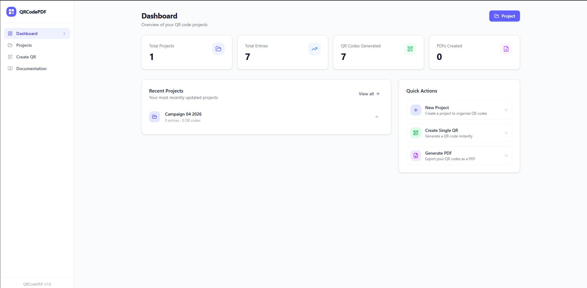
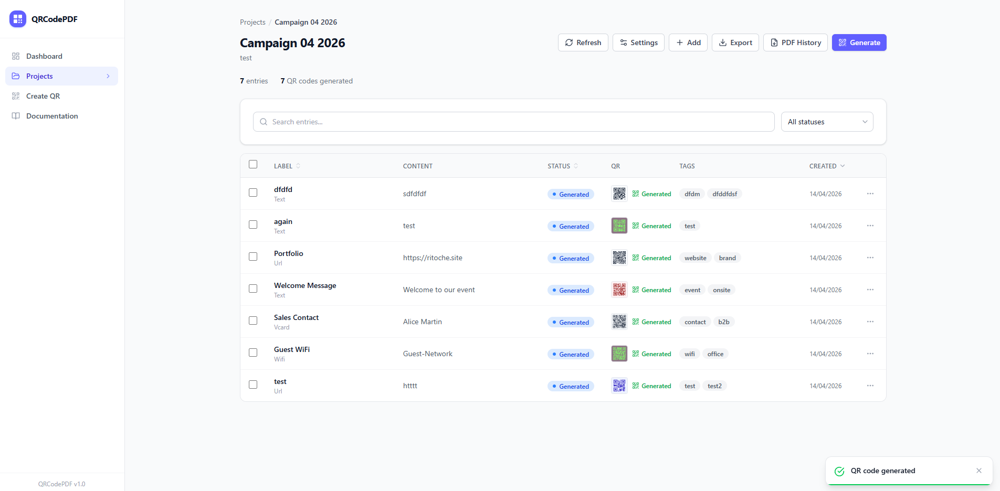
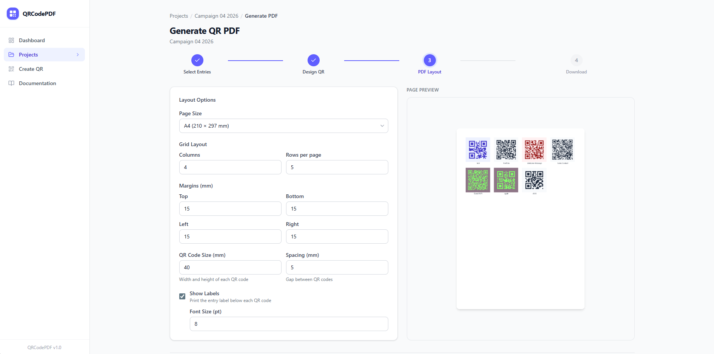
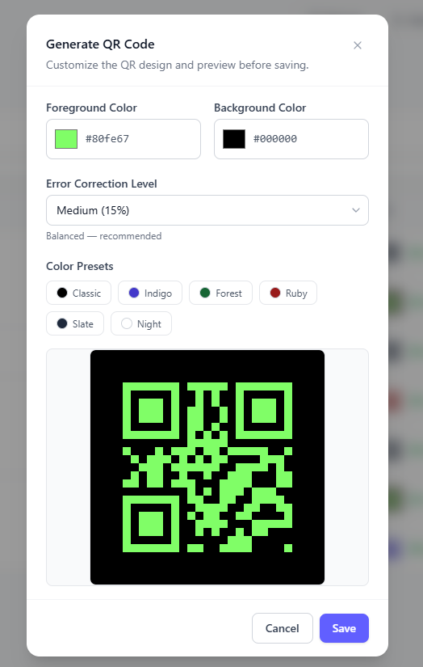
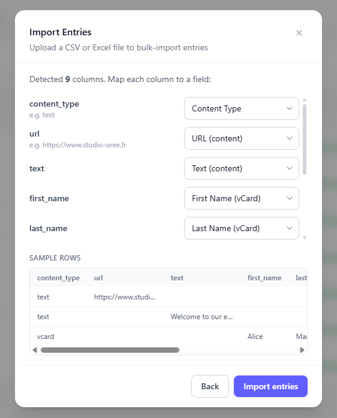
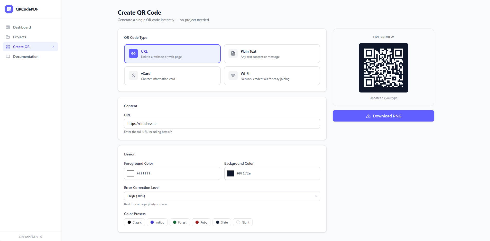

# QRCodePDF

> Generate, customize, and export QR codes to print-ready PDFs — all from a clean web interface.

[](https://github.com/Ritoche1/QrcodePdf_list_generator/actions/workflows/ci.yml)


QRCodePDF is an open-source, self-hosted web application for generating QR codes in bulk and exporting them as professional, print-ready PDF documents. Manage your QR entries in projects, customize designs, preview layouts, and download — no account required.

## Live Demo

Try the public demo: [https://qr.ritoche.site](https://qr.ritoche.site)

The hosted demo runs with `DEMO_MODE=true`:
- data shown on the site may be mocked or reset
- some write/export operations are restricted or simulated (for example PDF generation)
- standalone QR creation remains available for quick testing

---

## Screenshots

> **Where to place your screenshots:**
> Create a `docs/screenshots/` directory and add the images there. Then they'll render automatically in this README.

| Dashboard | Project Detail |
|-----------|---------------|
|  |  |

| PDF Layout Builder | QR Design Options |
|-------------------|------------------|
|  |  |

| Bulk Import | Standalone QR Creator |
|------------|----------------------|
|  |  |

---

## Features

### QR Code Generation
- **Multiple content types**: URL, plain text, vCard contacts, Wi-Fi credentials
- **Design customization**: foreground/background colors, error correction levels (L/M/Q/H)
- **Standard default template**: dark slate foreground (`#1f2937`), white background (`#ffffff`), and `Q` error correction for strong scan reliability
- **Live preview**: see your QR code update in real-time as you type
- **Input validation**: warnings for invalid URLs, oversized content, and duplicates

### PDF & Export
- **Configurable PDF layout**: page size (A4/Letter), margins, grid columns × rows, QR size, spacing
- **QR render mode selection**: use each entry's cached QR design (with standard fallback) or force one selected design for the whole PDF
- **Labels & serial numbers**: optional text below each QR code
- **PDF preview**: see the first page before downloading
- **Batch PNG export**: download all QR codes as individual PNGs in a ZIP archive
- **CSV/XLSX export**: export your data back to spreadsheet format

### Project Management
- **Projects**: organize QR entries into named projects
- **Project-level default QR design**: administrators can update the default QR colors/error correction from the project **Settings** popup
- **Bulk import**: upload CSV or XLSX files with an interactive column mapping UI
- **Entry status**: track entries through Draft → Generated → Printed → Archived
- **Tagging**: add tags to entries for filtering and organization
- **Search & filters**: full-text search, filter by status, tags, and sort by any column
- **Bulk actions**: select multiple entries to change status, generate QR codes, export as ZIP or CSV/XLSX, or delete
- **Inline editing**: edit any entry's content directly from the project page without entering the PDF wizard

### Standalone QR Creator
- Quick single QR code generator — no project needed
- Choose type, customize design, preview, and download PNG instantly

---

## Quick Start

### Docker Compose (recommended)

```bash
git clone https://github.com/Ritoche1/QrcodePdf_list_generator.git
cd QrcodePdf_list_generator
docker compose up -d
```

Open [http://localhost](http://localhost) in your browser.

Want to see it first? Visit the live demo at [https://qr.ritoche.site](https://qr.ritoche.site).

- **Frontend**: port 80 (nginx)
- **Backend API**: port 8000 (FastAPI)
- **Data**: persisted in a Docker volume (`qrcodepdf-data`)

### Local Development

#### Backend

```bash
cd backend
python -m venv .venv
source .venv/bin/activate   # Windows: .venv\Scripts\activate
pip install -r requirements.txt

# Create data directory
mkdir -p /tmp/qrcodepdf-data

# Run
DATA_DIR=/tmp/qrcodepdf-data uvicorn app.main:app --reload --port 8000
```

#### Frontend

```bash
cd frontend
npm install
npm run dev
```

The frontend dev server runs on [http://localhost:5173](http://localhost:5173) and proxies API calls to `localhost:8000`.

---

## Architecture

```
┌─────────────┐     ┌──────────────────┐     ┌──────────┐
│   Browser    │────▶│  Nginx (port 80) │────▶│  FastAPI  │
│  React SPA   │     │  Static files +  │     │ port 8000 │
└─────────────┘     │  /api proxy      │     └─────┬────┘
                    └──────────────────┘           │
                                                   ▼
                                            ┌────────────┐
                                            │   SQLite    │
                                            │ + /data/    │
                                            │   files/    │
                                            └────────────┘
```

| Component | Technology |
|-----------|-----------|
| Frontend | React 19, TypeScript, Tailwind CSS v4, React Router, TanStack Query |
| Backend | FastAPI, SQLAlchemy 2.0 (async), Pydantic v2 |
| Database | SQLite (via aiosqlite) |
| QR Engine | qrcode + Pillow |
| PDF Engine | fpdf2 |
| Import/Export | pandas + openpyxl |
| Deployment | Docker Compose (nginx + uvicorn) |

---

## API Reference

All endpoints are under `/api/v1/`. Full OpenAPI docs are available at [http://localhost:8000/docs](http://localhost:8000/docs) when the backend is running.

### Projects

| Method | Endpoint | Description |
|--------|----------|-------------|
| `GET` | `/projects` | List all projects |
| `POST` | `/projects` | Create a project |
| `GET` | `/projects/{id}` | Get project details |
| `PUT` | `/projects/{id}` | Update a project |
| `DELETE` | `/projects/{id}` | Delete project and all entries |

### Entries

| Method | Endpoint | Description |
|--------|----------|-------------|
| `GET` | `/projects/{id}/entries` | List entries (search, filter, paginate) |
| `POST` | `/projects/{id}/entries` | Create an entry |
| `POST` | `/projects/{id}/entries/bulk` | Bulk create entries |
| `PUT` | `/entries/{id}` | Update an entry |
| `DELETE` | `/entries/{id}` | Delete an entry |
| `PATCH` | `/entries/bulk-status` | Bulk update entry status |
| `PATCH` | `/entries/bulk-tags` | Bulk add/remove tags |

### QR Generation

| Method | Endpoint | Description |
|--------|----------|-------------|
| `POST` | `/qr/preview` | Generate a QR preview (returns PNG) |
| `POST` | `/qr/generate/{entry_id}` | Generate/store QR for an entry (reuses cache when up-to-date) |
| `POST` | `/qr/generate-bulk` | Generate/store QR codes for multiple entries |

### PDF Generation

| Method | Endpoint | Description |
|--------|----------|-------------|
| `POST` | `/projects/{id}/pdf` | Generate full PDF |
| `POST` | `/projects/{id}/pdf/preview` | Preview first page (PNG) |
| `POST` | `/projects/{id}/export` | Export QR images as ZIP |

### Import / Export

| Method | Endpoint | Description |
|--------|----------|-------------|
| `POST` | `/projects/{id}/import/preview` | Upload file, get column mapping |
| `POST` | `/projects/{id}/import/confirm` | Confirm mapping and import |
| `GET` | `/projects/{id}/export/data` | Export all entries as CSV or XLSX |
| `POST` | `/projects/{id}/export/data` | Export selected entries as CSV or XLSX |

### Stats

| Method | Endpoint | Description |
|--------|----------|-------------|
| `GET` | `/stats` | Dashboard statistics |

---

## Project Structure

```
QrcodePdf_list_generator/
├── backend/
│   ├── app/
│   │   ├── api/
│   │   │   ├── routes/          # API route handlers
│   │   │   └── router.py        # Main router
│   │   ├── core/
│   │   │   ├── config.py        # App settings
│   │   │   └── database.py      # SQLAlchemy setup
│   │   ├── models/              # SQLAlchemy models
│   │   ├── schemas/             # Pydantic schemas
│   │   ├── services/            # Business logic
│   │   └── main.py              # FastAPI entry point
│   ├── tests/
│   ├── requirements.txt
│   └── Dockerfile
├── frontend/
│   ├── src/
│   │   ├── components/
│   │   │   ├── ui/              # Reusable UI components
│   │   │   ├── layout/          # App layout (sidebar, header)
│   │   │   ├── qr/              # QR-specific components
│   │   │   ├── pdf/             # PDF layout components
│   │   │   └── entries/         # Entry management components
│   │   ├── pages/               # Route pages
│   │   ├── hooks/               # React Query hooks
│   │   ├── lib/                 # API client
│   │   └── types/               # TypeScript types
│   ├── nginx.conf
│   └── Dockerfile
├── docs/
│   ├── API.md
│   └── CONTRIBUTING.md
├── docker-compose.yml
├── .env.example
├── LICENSE
└── README.md
```

---

## Configuration

| Variable | Default | Description |
|----------|---------|-------------|
| `DATA_DIR` | `/data` | Directory for SQLite DB and generated files |
| `DATABASE_URL` | `sqlite+aiosqlite:///data/qrcodepdf.db` | Database connection string |
| `DEMO_MODE` | `false` | Enable showcase mode with mocked data and restricted write actions |
| `VITE_API_URL` | `http://localhost:8000/api/v1` | Backend URL (frontend build-time) |

---

## Contributing

See [docs/CONTRIBUTING.md](docs/CONTRIBUTING.md) for guidelines on how to contribute.

1. Fork the repository
2. Create a feature branch (`git checkout -b feature/my-feature`)
3. Commit your changes (`git commit -m 'feat: add my feature'`)
4. Push to the branch (`git push origin feature/my-feature`)
5. Open a Pull Request

---

## Roadmap

Check the [GitHub Issues](https://github.com/Ritoche1/QrcodePdf_list_generator/issues) for the full feature backlog, organized by labels:

- `qr-generation` — QR code features
- `pdf-generation` — PDF & export features
- `data-management` — Lists and data features
- `collaboration` — Sharing & multi-user
- `analytics` — Scan tracking & dashboards
- `ui-ux` — Interface improvements
- `ops-reliability` — Infrastructure & security
- `integrations` — API & third-party integrations

---

## License

[MIT](LICENSE) — free to use, modify, and distribute.
